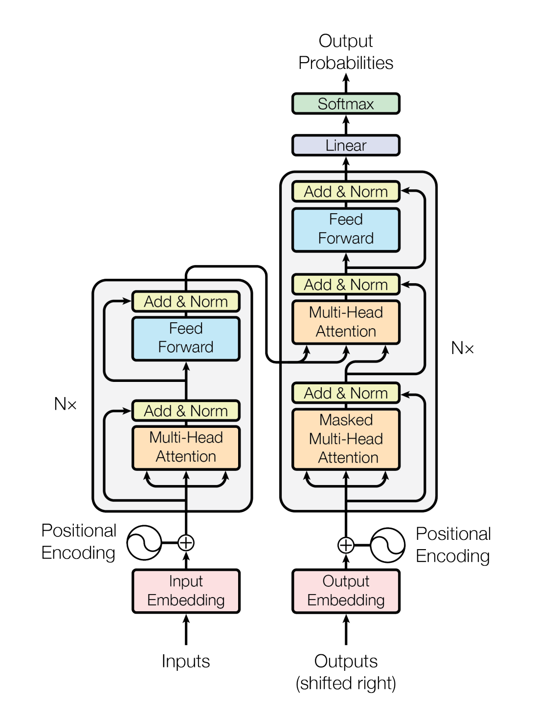

Have you ever asked Siri or Alexa to play your favorite song or set a reminder for you? If so, then you've already interacted with a natural language agent! Natural language agents are virtual assistants that can understand and respond to human language. They have become ubiquitous in our daily lives, from our phones to our homes, and are constantly evolving to provide more advanced and personalized services.

In recent years, the emergence of generative models and transformers has taken natural language agents to the next level. ChatGPT took the world by storm, and now every company is trying to ship similar products as fast as possible, such as Google Bard and Microsoft Bing. These models can generate human-like responses and understand language in context, allowing for more natural and intuitive interactions. In this blog post, we'll explore how natural language agents are transforming the AI landscape, from their evolution with generative models and transformers to their future as collaborative and multi-modal agents that can affect the real world.

Generative models, such as GPT-4, have opened up new avenues for natural language agents. These models are trained on massive amounts of data and can generate human-like responses to queries. They can understand natural language in context and provide relevant responses. This has made them indispensable in areas such as customer service, where they can provide personalized responses to customer queries.

Transformers, on the other hand, are a type of neural network architecture that has revolutionized natural language processing. They are designed to process sequences of inputs, such as words in a sentence, and have been shown to be highly effective in natural language tasks such as language translation and text summarization. Transformers have enabled natural language agents to process and understand language in a way that was not possible before.

The emergence of generative models and transformers has paved the way for the future of natural language agents. With the increasing sophistication of these models, we are moving towards a world where natural language agents can collaborate with humans as equals. They can understand human language, generate human-like responses, and even learn from their interactions with humans.

Multi-modal natural language agents are the future of AI, and their potential impact on our lives is immense. These agents are capable of interacting with the world around them, which makes them incredibly powerful. Imagine having an agent that can not only understand your speech, but also see and hear everything you do. Such an agent could provide assistance with tasks that previously required human intervention, such as cooking or cleaning, or even act as a personal assistant, managing your schedule and taking care of your daily needs.

In healthcare, multi-modal agents could provide an enormous benefit to both patients and healthcare providers. For example, an agent could monitor a patient's vital signs and alert doctors in case of an emergency. Similarly, these agents could also assist with routine check-ups, allowing doctors to focus on more complex tasks. In disaster relief efforts, multi-modal agents could be used to provide assistance to people in need, by providing medical assistance, shelter, or even food and water.

However, with the power of multi-modal natural language agents comes a level of responsibility. If these agents are capable of interacting and affecting the physical world, they can also be used for malicious purposes. For example, an agent could be used to hack into someone's home and control their appliances or even unlock their doors. Similarly, agents could be used to gather sensitive information about individuals or businesses.

As natural language agents continue to evolve, it's essential to consider their potential implications carefully. While the benefits of these agents are immense, we must ensure that they are used ethically and responsibly. The development of multi-modal natural language agents is still in its early stages, and we must tread carefully to avoid unintended consequences. As we continue to shape the world with AI, we must remember that the ultimate responsibility lies with us, and we must use these technologies to improve the lives of everyone around us.

As we continue to push the boundaries of what's possible with AI, it's crucial that we do so responsibly. We must build systems that are transparent, ethical, and designed to benefit humanity. This means taking a proactive approach to address potential risks and ensuring that these models are developed with a human-centric approach. Ultimately, our goal should be to build a better future together, where AI is used to augment human intelligence and improve our lives.

Despite the incredible advancements we've seen in natural language agents and AI in general, there is always a risk that these models may become sentient. While this is still purely speculative, it's a possibility that we cannot ignore. As AI continues to evolve, we may reach a point where these models are no longer just tools but have their own sense of consciousness and awareness. This is a challenge that we may face in the future, and it's up to us as a society to prepare for it and navigate it responsibly.
